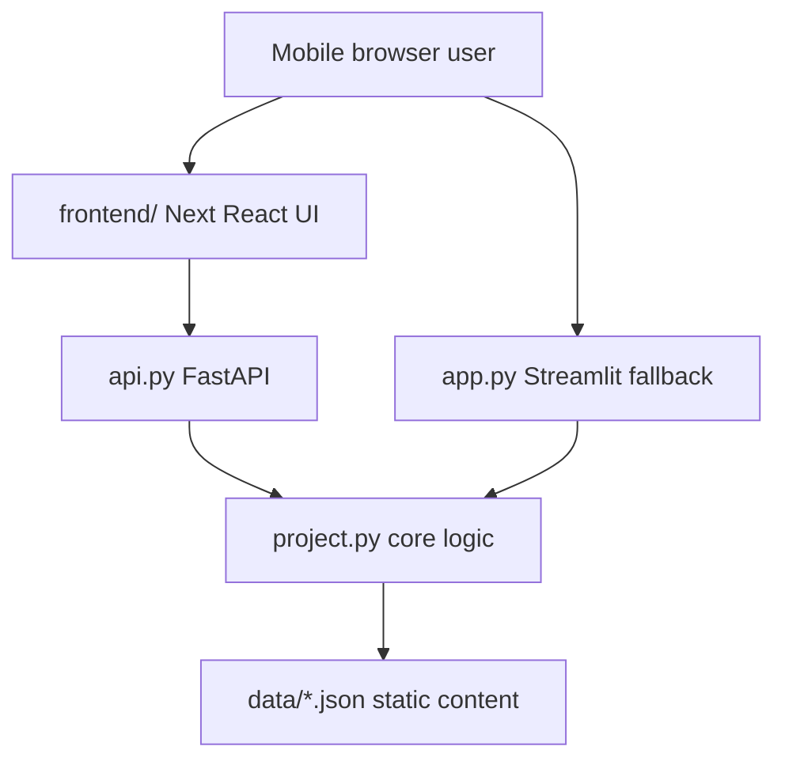

# Tech Stack & Tools

## Final MVP Stack

| Layer | Choice | Notes |
|---|---|---|
| Language | Python | Required by the course project |
| Primary UI framework | React / Next | Higher-quality frontend for the black-white-gray training dashboard |
| API framework | FastAPI | Thin Python API wrapper around `project.py` |
| Fallback UI framework | Streamlit | Python-only fallback prototype kept in `app.py` |
| Core logic | Plain Python functions in `project.py` | Keeps logic testable with pytest |
| Database | SQLite via Python `sqlite3` | Local, no server setup, enough for MVP logs/community |
| Charts/data handling | pandas + Streamlit charts | Simple progress visualizations |
| AI API | OpenAI-compatible client or provider SDK | Use user's API key through environment variables |
| Environment variables | python-dotenv | Local API key loading |
| Testing | pytest | Course requirement and core logic verification |
| Deployment | Local demo first, Streamlit Community Cloud optional | Keep deployment low-cost and simple |
| Future backend | FastAPI | Already introduced for the React frontend and later WeChat Mini Program API |
| Future database | MySQL or PostgreSQL | After MVP if multi-user cloud version is needed |

No exact package versions are specified yet. Use current stable versions for MVP, then optionally freeze exact versions before final submission.

## Expected `requirements.txt`

```text
streamlit
pytest
pandas
python-dotenv
openai
fastapi
uvicorn
```

If the user's AI provider does not support the OpenAI-compatible SDK, replace `openai` with the provider's SDK and update this file.

## Setup Commands

Install dependencies:

```bash
python -m pip install -r requirements.txt
```

Run tests:

```bash
python -m pytest
```

Run Python API:

```bash
python -m uvicorn api:app --reload --port 8000
```

Run React/Next frontend:

```bash
cd frontend
npm install
npm run dev
```

Run Streamlit fallback:

```bash
streamlit run app.py
```

Optional:

```bash
python -m pip freeze
```

## Project Structure

```text
group project/
  api.py
  app.py
  project.py
  test_project.py
  requirements.txt
  README.md
  AGENTS.md
  MEMORY.md
  REVIEW-CHECKLIST.md
  CLAUDE.md
  GEMINI.md
  .cursorrules
  .cursor/
    rules/
      gympath.mdc
  .github/
    copilot-instructions.md
  frontend/
    app/
      globals.css
      layout.tsx
      page.tsx
    lib/
      api.ts
    package.json
    tsconfig.json
  data/
    exercises.json
    knowledge_cards.json
    sample_seed.json
  docs/
    research-GymPath.md
    PRD-GymPath-MVP.md
    TechDesign-GymPath-MVP.md
    ai_prompt_log.md
    final_report_outline.md
  agent_docs/
    project_brief.md
    product_requirements.md
    tech_stack.md
    code_patterns.md
    testing.md
  gympath.db
```

## Architecture Pattern



## React/Next UI Rules

- Use only black, white, and gray in the primary frontend.
- Prefer native HTML controls: `button`, `input`, `select`, `progress`, `details`, `summary`.
- Keep React components presentational; call Python logic only through `api.py`.
- Do not add shadcn/ui runtime components unless the project is explicitly converted to a full shadcn setup.

## Streamlit UI Pattern

Keep Streamlit as a fallback prototype. The primary product UI is now React/Next.

```python
import streamlit as st

from project import generate_workout_plan, calculate_protein_target


def render_assessment():
    st.subheader("Build your plan")
    level = st.selectbox("Training level", ["beginner", "restarting", "experienced"])
    goal = st.selectbox("Goal", ["muscle_gain", "strength_gain", "fat_loss", "general_fitness"])
    days = st.slider("Training days per week", 2, 6, 3)
    minutes = st.slider("Minutes per session", 30, 120, 60)

    if st.button("Generate plan"):
        plan = generate_workout_plan(level, goal, days, minutes)
        st.session_state["current_plan"] = plan
        st.success("Plan generated.")
```

## Error Handling Pattern

Use explicit validation and user-friendly messages.

```python
def calculate_bmi(weight_kg: float, height_cm: float) -> float:
    if weight_kg <= 0:
        raise ValueError("Weight must be greater than zero.")
    if height_cm <= 0:
        raise ValueError("Height must be greater than zero.")

    height_m = height_cm / 100
    return round(weight_kg / (height_m ** 2), 1)
```

In Streamlit:

```python
try:
    bmi = calculate_bmi(weight_kg, height_cm)
    st.metric("BMI reference", bmi)
except ValueError as exc:
    st.warning(str(exc))
```

## Naming Conventions

- Python files: `snake_case.py`
- Functions: `snake_case`
- Constants: `UPPER_SNAKE_CASE`
- Database tables: `snake_case`
- JSON keys: `snake_case`
- Streamlit render functions: `render_today_screen`, `render_plan_screen`
- Test functions: `test_<function>_<scenario>`

## Database

Use SQLite and auto-create tables on app startup.

Main tables:

- `user_profiles`
- `workout_plans`
- `workout_sessions`
- `measurements`
- `community_posts`
- `community_comments`
- `chat_messages`

Full schema is in `docs/TechDesign-GymPath-MVP.md`.

## Deployment

MVP deployment priority:

1. Local demo: `streamlit run app.py`
2. Optional Streamlit Community Cloud
3. Future backend with FastAPI/Flask for WeChat Mini Program or production web
