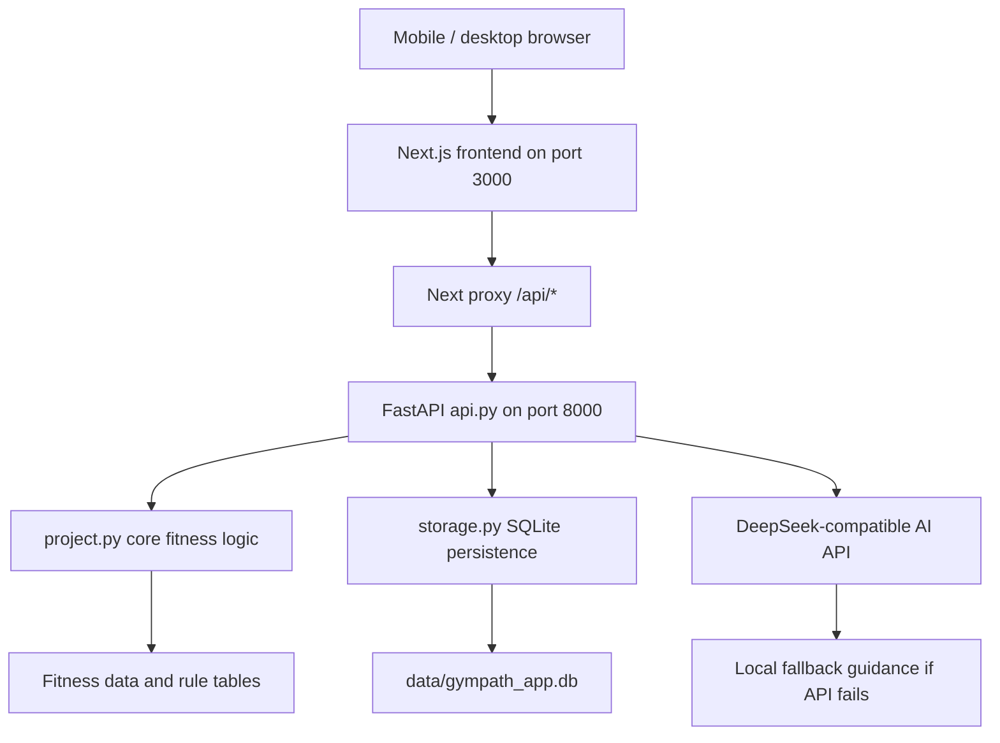
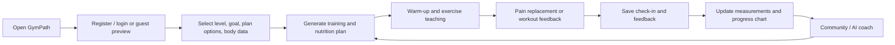

# Technical Design Document: GymPath MVP

**Project:** GymPath  
**Version:** MVP 1.0  
**Platform:** Mobile-first web app  
**Primary build approach:** Python core + FastAPI backend + React/Next frontend  
**Last updated:** 2026-05-16

## 1. Overview

GymPath is a mobile-first fitness web app that reduces training decision fatigue. The user registers or enters as a guest, chooses training level and goal, receives a structured plan, views warm-up and exercise teaching links, logs nutrition and measurements, checks in after training, receives light plan adjustments, posts in the community, and asks an AI fitness coach questions.

The course requirement remains Python-centered:

- `project.py` contains `main()` and testable custom top-level functions.
- `test_project.py` contains pytest tests for deterministic business logic.
- `api.py` exposes the Python logic through FastAPI.
- The React/Next frontend is the primary UI because the user approved moving beyond Streamlit for a stronger interface.
- `app.py` remains only as an older Python-only Streamlit fallback prototype.

## 2. Current Architecture Recommendation

Build and demo GymPath as a **FastAPI + React/Next + SQLite** app while keeping the important logic in Python.

| Need | Selected approach | Reason |
|---|---|---|
| Course requires Python | `project.py` + pytest + FastAPI | Core algorithms are Python and testable |
| Better UI quality | React/Next frontend | Much higher control than Streamlit for the black/white athletic interface |
| Beginner-friendly persistence | SQLite | No separate database server needed; works on the user's computer |
| Real app behavior | Local accounts + sessions | Users can register, log in, post, comment, like, and save personal records |
| AI coaching | DeepSeek/OpenAI-compatible API + local fallback | Real answers when configured, demo-safe fallback when unavailable |
| Future expansion | FastAPI boundary | Can later connect to MySQL/PostgreSQL, cloud hosting, or WeChat Mini Program |

### Alternatives

| Option | Pros | Cons | Decision |
|---|---|---|---|
| Streamlit only | Fast Python UI, easiest for first prototype | UI ceiling is lower; mobile and community polish are weaker | Kept only as fallback |
| Flask templates | Python web app with more control | More manual frontend work than current stack | Not used |
| Django | Built-in auth/admin/ORM | Too heavy for this course MVP | Not used |
| WeChat Mini Program first | Strong China mobile distribution | Frontend cannot be Python; extra deployment and review complexity | Future version |

## 3. System Architecture



## 4. Main Files

| File / folder | Responsibility |
|---|---|
| `project.py` | Core business logic: training plans, nutrition, pain guidance, check-in reward, AI fallback |
| `api.py` | FastAPI routes and request/response models |
| `storage.py` | SQLite setup, accounts, sessions, community, check-ins, measurements, workout feedback |
| `frontend/app/page.tsx` | Main React UI and client-side state |
| `frontend/lib/api.ts` | Fetch helpers for GET/POST/PUT JSON calls |
| `frontend/next.config.mjs` | Same-origin `/api` proxy to FastAPI |
| `test_project.py` | Pytest tests for Python business logic |
| `app.py` | Streamlit fallback prototype only |
| `scripts/start_gympath.ps1` | Starts API and production Next server in LAN mode |
| `scripts/start_public_tunnel.ps1` | Creates temporary public Cloudflare Tunnel to the local app |

## 5. Product Flow



## 6. API Design

| Method | Endpoint | Purpose | Auth |
|---|---|---|---|
| `GET` | `/api/health` | Health check | No |
| `POST` | `/api/auth/register` | Create local account and session | No |
| `POST` | `/api/auth/login` | Log in and receive token | No |
| `GET` | `/api/auth/me` | Validate current session | Yes |
| `POST` | `/api/plan` | Generate training plan | No |
| `POST` | `/api/nutrition` | Generate nutrition targets and diet plan | No |
| `GET` | `/api/food-library` | Load food options for meal logging | No |
| `POST` | `/api/meal-totals` | Calculate selected meal macros | No |
| `POST` | `/api/pain` | Classify pain and suggest substitutions | No |
| `POST` | `/api/feedback` | Adjust next plan; save feedback when logged in | Optional |
| `POST` | `/api/progress` | Analyze supplied measurement trend | No |
| `GET` | `/api/progress/measurements` | Load saved measurements | Yes |
| `PUT` | `/api/progress/measurements` | Replace saved measurements | Yes |
| `GET` | `/api/checkins` | Load saved check-in dates | Yes |
| `POST` | `/api/checkins` | Save check-in date | Yes |
| `GET` | `/api/community/posts` | List community posts | Optional |
| `POST` | `/api/community/posts` | Create post | Yes |
| `POST` | `/api/community/posts/{id}/like` | Toggle like | Yes |
| `POST` | `/api/community/posts/{id}/comments` | Add comment | Yes |
| `POST` | `/api/ai-chat` | Ask AI coach | Optional |
| `GET` | `/api/knowledge/{topic}` | Load knowledge card | No |

## 7. SQLite Persistence

`storage.py` creates the database automatically at `data/gympath_app.db`.

Current tables:

- `users`: username, optional email, password hash, salt, created time
- `sessions`: hashed token, user id, expiration
- `posts`: community posts
- `comments`: community comments
- `post_likes`: post likes
- `measurements`: saved date, weight, waist, body-fat estimate
- `checkins`: saved check-in dates
- `workout_feedbacks`: completion, fatigue, duration, pain, and adjustment JSON

Trade-off: SQLite is acceptable for a course MVP and LAN/public-tunnel demo. A real production launch should move to MySQL/PostgreSQL on a hosted server.

## 8. Core Python Functions

`project.py` should remain the source of truth for deterministic logic.

| Function | Purpose | Test priority |
|---|---|---|
| `calculate_bmi` | Basic BMI reference | High |
| `classify_user_level` | Beginner/restarting/experienced classification | High |
| `recommend_training_split` | Chooses current split style | High |
| `generate_workout_plan` | Generates training days, warm-ups, exercises, and links | High |
| `generate_diet_plan` | Generates fat-loss, muscle-gain, strength, or health nutrition plan | High |
| `calculate_day_meal_totals` | Calculates meal macros from selected foods | Medium |
| `assess_pain_response` | Continue/modify/stop decision logic | High |
| `suggest_exercise_substitution` | Substitutes painful movements | Medium |
| `get_joint_pain_guidance` | Joint-specific relief, rehab, and video links | Medium |
| `adjust_plan_after_feedback` | Light adjustment after workout feedback | High |
| `get_checkin_reward_status` | Seven-day supplement lottery progress | Medium |
| `summarize_progress_trend` | Weight/waist/body-fat trend summary | Medium |
| `get_ai_fitness_reply` | DeepSeek API call and local fallback | Medium |

## 9. UI Structure

The primary UI is `frontend/app/page.tsx`.

| View | Purpose |
|---|---|
| Plan | Training profile, plan selector, weekly schedule, warm-up, teaching links |
| Nutrition | Diet targets, fat-loss/muscle-gain logic, food selection, meal totals |
| Pain | Anatomy image, joint selection, pain type/severity, substitutions, rehab links |
| Feedback | Completion, fatigue, pain, duration, adjustment, seven-day check-in lottery |
| Progress | Saved weight, waist, body-fat trend lines |
| Community | Login state, post composer, feed, likes, comments |
| Knowledge | Fitness myth-busting and training education |
| Coach | AI chat with profile, plan, feedback, pain, and progress context |

Design direction:

- black/white/gray only
- native HTML controls
- mobile-first layout
- athletic, premium, and clean visual tone
- no placeholder text or generic AI-looking cards

## 10. AI Coach

Environment variables:

```text
DEEPSEEK_API_KEY=your_key
DEEPSEEK_BASE_URL=https://api.deepseek.com
DEEPSEEK_MODEL=deepseek-v4-pro
```

The frontend sends:

- training level and goal
- body data and activity level
- current plan summary
- latest workout feedback
- latest pain check
- recent measurement entries
- user question

Safety boundary:

- The coach provides fitness education, not medical diagnosis.
- Severe, sharp, worsening, radiating pain, numbness, or loss of function should trigger stop-and-seek-professional-help language.
- If the API fails, the local fallback still answers common fitness questions.

## 11. Run Commands

Install Python dependencies:

```bash
python -m pip install -r requirements.txt
```

Install frontend dependencies:

```bash
cd frontend
npm install
cd ..
```

Run backend:

```bash
python -m uvicorn api:app --reload --host 0.0.0.0 --port 8000
```

Run frontend:

```bash
cd frontend
npm run dev:lan
```

Production-style local/LAN run:

```powershell
powershell -ExecutionPolicy Bypass -File scripts/start_gympath.ps1
```

Temporary public tunnel:

```powershell
powershell -ExecutionPolicy Bypass -File scripts/start_public_tunnel.ps1
```

## 12. Testing Strategy

Automated:

```bash
python -m pytest
cd frontend
npm run typecheck
npm run build
```

Manual:

1. Register a new account.
2. Generate a plan.
3. Submit feedback and check in.
4. Save measurements and refresh the page.
5. Confirm measurements/check-ins persist after login.
6. Create a community post, like it, and comment.
7. Ask AI coach with API key enabled and then test fallback by removing the key.
8. Open the site from a phone-width viewport and verify no blocking layout issue.

## 13. Security and Privacy

| Area | MVP rule |
|---|---|
| API key | Never commit `.env`; use `.env.example` for placeholders only |
| Passwords | Store salted PBKDF2 hashes, not plaintext |
| Sessions | Store only token hashes in SQLite |
| Community | Require login for write actions |
| Personal records | Store locally in SQLite for the MVP |
| Medical safety | Avoid diagnosis; use clear stop rules |
| Public sharing | Public tunnel exposes this computer while running; stop services when finished |

## 14. Future Architecture Path

Version 2 can move to:

- MySQL/PostgreSQL
- hosted backend on Railway/Render/Fly.io/VPS
- cloud object storage for images
- email verification and password reset
- moderation tools for community
- WeChat Mini Program frontend that calls the same FastAPI backend

## 15. Definition of Technical Success

The MVP is technically successful when:

- `python -m pytest` passes.
- `npm run typecheck` and `npm run build` pass.
- `project.py` keeps `main()` and testable Python functions.
- A user can register, generate a plan, log feedback, check in, save progress, use community, and ask AI.
- Logged-in progress/check-in/feedback/community data are stored in SQLite.
- The app works on mobile-sized screens.
- README explains local, LAN, public tunnel, and collaborator setup.
