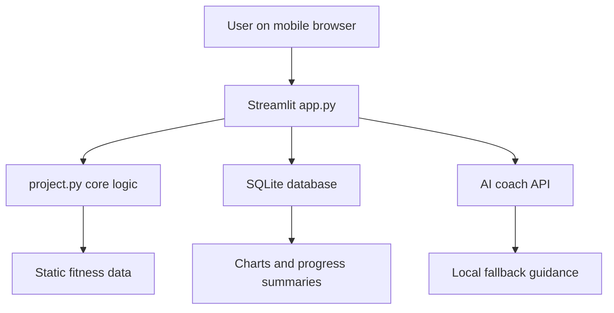
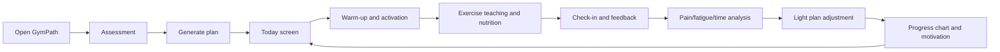
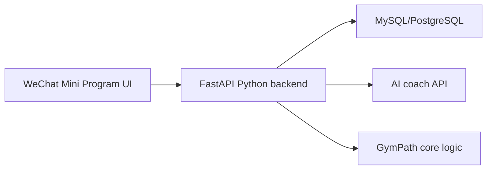

# Technical Design Document: GymPath MVP

**Project:** GymPath  
**Version:** MVP 1.0  
**Platform:** Mobile-first Python web app  
**Primary build approach:** AI-assisted development with Python-first architecture  
**Last updated:** 2026-05-14

## 1. Overview

GymPath is a mobile-first fitness web app that reduces training decision fatigue. A user enters basic profile data, chooses a level, goal, weekly training days, and available time. GymPath then generates a training plan, shows warm-up and activation guidance, provides exercise teaching links and nutrition guidance, records workout feedback, lightly adjusts future plans, visualizes progress, supports nickname-based community interaction, and uses an AI coach to explain fitness concepts.

The technical design prioritizes:

- Meeting the course requirement for a Python project with `project.py`, `main()`, custom top-level functions, pytest tests, `requirements.txt`, README, final report, and AI prompt log.
- Keeping the app buildable by a beginner who mostly relies on AI coding.
- Making the core logic testable and not trapped inside UI code.
- Creating a polished mobile-first interface without introducing a heavy front-end stack too early.
- Allowing future migration to MySQL, a real backend, and WeChat Mini Program after the MVP.

## 2. Final Recommendation

Build GymPath as a **Streamlit + Python + SQLite MVP**.

### Why this is the best first version

| Need | Best fit | Reason |
|---|---|---|
| Course requires Python | Streamlit + Python | The visible app and core logic are both Python-based. |
| Beginner-friendly with AI | Streamlit | Less setup than Flask, Django, React, or WeChat Mini Program. |
| Testable business logic | `project.py` functions + pytest | Recommendation, nutrition, pain, streak, and adjustment logic can be unit tested. |
| Mobile-first demo | Streamlit layout + CSS | Fast enough for an MVP and can look professional with careful layout. |
| Community and logs | SQLite | More realistic than JSON, simpler than MySQL server setup. |
| Future expansion | Python logic remains reusable | Later Flask/FastAPI/WeChat front ends can reuse the same core logic. |

## 3. Major Technical Decisions

### 3.1 Platform Choice

| Option | Pros | Cons | Recommendation |
|---|---|---|---|
| Streamlit web app | Fastest Python-first UI, simple widgets, charts, session state, easy local demo | Less front-end control than React or custom HTML | **Use for MVP** |
| Flask web app | More control over routes, HTML, CSS, and database flows | More files, templates, forms, and front-end work | Good v2 if Streamlit feels limiting |
| Django web app | Strong database, auth, admin, scalable structure | Too much setup for this MVP and course timeline | Not for MVP |
| WeChat Mini Program + Python backend | Best long-term China mobile direction | Front end is WXML/WXSS/JS, not Python; more deployment complexity | Future version after web MVP |

**Trade-off:** Streamlit is not the most flexible production UI framework, but it gives the best chance of producing a working, tested, good-looking Python MVP quickly.

### 3.2 Data Storage Choice

| Option | Pros | Cons | Recommendation |
|---|---|---|---|
| SQLite | Built into Python, no server setup, supports tables for logs/community/chat | Local-first, weaker for real multi-user deployment | **Use for MVP** |
| MySQL | User already knows basics, closer to real production database | Requires server setup, credentials, more debugging | Future migration |
| JSON files | Very simple and readable | Harder for community, charts, comments, and relations | Only backup if SQLite becomes too much |

**Trade-off:** SQLite is not ideal for a large live community, but it is perfect for a course demo and avoids database installation problems.

### 3.3 AI Integration Choice

| Option | Pros | Cons | Recommendation |
|---|---|---|---|
| Rule-based only | Free, predictable, easy to test | Less impressive, weaker for open questions | Keep as fallback |
| AI API only | Flexible answers, better beginner education | Costs tokens, may fail, needs safety boundaries | Use carefully |
| Hybrid AI + local fallback | Best demo reliability and user value | Slightly more code | **Use for MVP** |

**Recommendation:** Use a hybrid AI coach. The app sends only limited training context and user questions to the API. If the API fails, local educational rules still answer common beginner questions.

### 3.4 UI Generation Choice

The UI should be generated and refined using the user's local skill workflow.

Relevant local skills read:

- `frontend-design`: generate distinctive, production-grade front-end interfaces with clear aesthetic direction and avoid generic AI-looking UI.
- `plan-eng-review`: review architecture, data flow, edge cases, tests, and performance before large implementation.
- `plan-design-review`: review UI/UX plans before implementation.
- `brainstorming`: use before major new features or behavior changes to clarify scope and design.

**Recommendation:** For the MVP, build the UI in Streamlit, but apply the `frontend-design` skill as the design generation standard. If later moving to React or WeChat Mini Program, reuse the same UI direction and screen structure.

**Trade-off:** Streamlit UI is less flexible than React, but skill-guided CSS, layout, cards, spacing, and copy can still make it feel polished and app-like.

## 4. System Architecture

### 4.1 High-Level Architecture



### 4.2 Main Layers

| Layer | File / module | Responsibility |
|---|---|---|
| UI layer | `app.py` | Streamlit screens, forms, tabs, buttons, charts, CSS styling |
| Core logic | `project.py` | Testable business logic: plans, nutrition, pain response, streaks, adjustments |
| Storage layer | `storage.py` or simple functions in `app.py` | SQLite setup, save/load users, sessions, posts, comments, chats |
| Static data | `data/exercises.json`, `data/knowledge_cards.json` | Exercises, video links, substitutions, learning content |
| AI service | `ai_coach.py` | API calls, prompt construction, fallback answers |
| Tests | `test_project.py` | Unit tests for core functions |
| Docs | README, report, prompt log | Course deliverables |

## 5. Recommended File Structure

```text
group project/
  app.py
  project.py
  test_project.py
  requirements.txt
  README.md
  PRD-GymPath-MVP.md
  research-GymPath.md
  TechDesign-GymPath-MVP.md
  data/
    exercises.json
    knowledge_cards.json
    sample_seed.json
  docs/
    ai_prompt_log.md
    final_report_outline.md
  gympath.db
```

### Important course alignment

`project.py` must remain meaningful even though the visible app is launched through `app.py`.

Recommended rule:

- `project.py` contains `main()` and all testable custom functions.
- `app.py` imports functions from `project.py`.
- `test_project.py` imports from `project.py`.
- Streamlit is only the interface. The important logic lives outside the UI.

Example structure:

```python
# project.py
def main():
    demo_profile = {
        "level": "beginner",
        "goal": "muscle_gain",
        "days_per_week": 3,
        "minutes_per_session": 60,
    }
    return generate_workout_plan(**demo_profile)
```

## 6. Core Product Flow



## 7. Core Functions in `project.py`

The project should include more than the required three functions so the app feels real, but tests should focus on stable deterministic logic.

| Function | Purpose | Test priority |
|---|---|---|
| `calculate_bmi(weight_kg, height_cm)` | Returns BMI as a basic reference only | High |
| `classify_user_level(training_months, weekly_frequency, consistency)` | Classifies beginner, restarting, or experienced user | High |
| `recommend_training_split(level, goal, days_per_week)` | Chooses full-body, upper/lower, PPL, or strength split | High |
| `generate_workout_plan(level, goal, days_per_week, minutes_per_session)` | Generates weekly plan with exercises, sets, reps, rest, notes | High |
| `calculate_protein_target(weight_kg, goal)` | Gives daily protein target | High |
| `calculate_calorie_target(weight_kg, height_cm, age, gender, goal, activity_level)` | Gives simple calorie target | Medium |
| `assess_pain_response(pain_location, pain_type, pain_level)` | Classifies discomfort and recommends continue, modify, or stop | High |
| `suggest_exercise_substitution(exercise_name, pain_location, goal)` | Suggests safer or better-feeling alternatives | Medium |
| `adjust_plan_after_feedback(plan, feedback)` | Reduces volume, changes rest, or swaps exercises after check-in | High |
| `calculate_checkin_streak(checkin_dates)` | Calculates current streak from date strings | High |
| `summarize_progress_trend(measurements)` | Produces progress summary from measurements | Medium |
| `get_knowledge_card(topic)` | Returns beginner education or myth-busting content | Low |

### Minimum pytest coverage

At least these functions should be tested:

- `calculate_bmi`
- `recommend_training_split`
- `generate_workout_plan`
- `assess_pain_response`
- `adjust_plan_after_feedback`
- `calculate_checkin_streak`

## 8. Business Logic Rules

### 8.1 User Level Logic

| User type | Rule | Plan style |
|---|---|---|
| Beginner | Low training experience or inconsistent basics | Full-body plan, lower volume, more explanation |
| Restarting user | Previous experience but recent gap or inconsistent training | Reduced volume restart plan |
| Experienced user | Consistent training history and gym familiarity | Split routine, advanced progression notes |
| Health-first user | Does not want gym or full training | Diet-first mode or home-bodyweight mode |

### 8.2 Training Split Logic

| Level | Days/week | Recommended split |
|---|---:|---|
| Beginner | 2-3 | Full-body |
| Beginner | 4 | Full-body or upper/lower |
| Restarting | 2-4 | Reduced full-body or upper/lower |
| Experienced | 3 | Push/pull/legs or full-body strength |
| Experienced | 4 | Upper/lower |
| Experienced | 5-6 | Push/pull/legs or bodybuilding split |

### 8.3 Pain-Aware Logic

Pain guidance must be educational, not medical diagnosis.

| Pain input | App response |
|---|---|
| Mild muscle burn or normal fatigue | Continue with form reminders |
| Mild joint discomfort | Reduce load, adjust range, show cues, suggest substitution |
| Form-related pattern such as bench discomfort from shoulder position | Show technique cues and safer alternatives |
| Sharp pain, worsening pain, numbness, severe pain | Stop today's exercise and suggest professional help |

Example rule:

```text
If pain_level >= 8 or pain_type in ["sharp", "numbness", "radiating"]:
    recommendation = "stop"
elif pain_level >= 5:
    recommendation = "modify_or_replace"
else:
    recommendation = "continue_with_cues"
```

### 8.4 Adaptive Plan Logic

The MVP should use light adjustment, not pretend to be a full AI periodization system.

| Feedback | Adjustment |
|---|---|
| User says workout too long | Reduce accessory exercises or sets |
| User says too tired | Lower volume by 20-30 percent for next similar session |
| User reports poor exercise feeling | Suggest substitute exercise next time |
| User completes easily | Add small progression suggestion |
| User misses sessions | Restart with reduced volume and encouraging copy |

## 9. Database Design

Use SQLite for MVP. Create the database automatically when the app starts.

### 9.1 Tables

```sql
CREATE TABLE IF NOT EXISTS user_profiles (
    id INTEGER PRIMARY KEY AUTOINCREMENT,
    nickname TEXT NOT NULL,
    age INTEGER,
    gender TEXT,
    height_cm REAL,
    weight_kg REAL,
    level TEXT,
    goal TEXT,
    days_per_week INTEGER,
    minutes_per_session INTEGER,
    gym_access TEXT,
    created_at TEXT NOT NULL
);

CREATE TABLE IF NOT EXISTS workout_plans (
    id INTEGER PRIMARY KEY AUTOINCREMENT,
    user_id INTEGER,
    plan_json TEXT NOT NULL,
    created_at TEXT NOT NULL,
    FOREIGN KEY (user_id) REFERENCES user_profiles(id)
);

CREATE TABLE IF NOT EXISTS workout_sessions (
    id INTEGER PRIMARY KEY AUTOINCREMENT,
    user_id INTEGER,
    plan_id INTEGER,
    session_date TEXT NOT NULL,
    workout_name TEXT,
    completed INTEGER NOT NULL,
    duration_min INTEGER,
    fatigue_level INTEGER,
    pain_level INTEGER,
    pain_location TEXT,
    notes TEXT,
    adjustment_json TEXT,
    FOREIGN KEY (user_id) REFERENCES user_profiles(id),
    FOREIGN KEY (plan_id) REFERENCES workout_plans(id)
);

CREATE TABLE IF NOT EXISTS measurements (
    id INTEGER PRIMARY KEY AUTOINCREMENT,
    user_id INTEGER,
    measurement_date TEXT NOT NULL,
    weight_kg REAL,
    body_fat_pct REAL,
    waist_cm REAL,
    chest_cm REAL,
    arm_cm REAL,
    thigh_cm REAL,
    notes TEXT,
    FOREIGN KEY (user_id) REFERENCES user_profiles(id)
);

CREATE TABLE IF NOT EXISTS community_posts (
    id INTEGER PRIMARY KEY AUTOINCREMENT,
    nickname TEXT NOT NULL,
    title TEXT NOT NULL,
    content TEXT NOT NULL,
    category TEXT,
    likes_count INTEGER DEFAULT 0,
    created_at TEXT NOT NULL
);

CREATE TABLE IF NOT EXISTS community_comments (
    id INTEGER PRIMARY KEY AUTOINCREMENT,
    post_id INTEGER NOT NULL,
    nickname TEXT NOT NULL,
    content TEXT NOT NULL,
    created_at TEXT NOT NULL,
    FOREIGN KEY (post_id) REFERENCES community_posts(id)
);

CREATE TABLE IF NOT EXISTS chat_messages (
    id INTEGER PRIMARY KEY AUTOINCREMENT,
    user_id INTEGER,
    role TEXT NOT NULL,
    content TEXT NOT NULL,
    created_at TEXT NOT NULL,
    FOREIGN KEY (user_id) REFERENCES user_profiles(id)
);
```

### 9.2 Data Trade-Off

For a local demo, one SQLite database is enough. For a future public product, move to MySQL or PostgreSQL with real authentication and cloud hosting.

## 10. UI/UX Technical Plan

### 10.1 Main Screens

Use Streamlit tabs or a sidebar navigation.

| Screen | Purpose | Key elements |
|---|---|---|
| Today | Show current workout and next action | Plan summary, warm-up, start/check-in button |
| Plan | Weekly plan and exercise teaching | Training days, exercises, sets/reps/rest, video links |
| Log | Feedback and progress | Workout feedback form, measurements, charts |
| Community | Social interaction | Nickname, post composer, feed, comments, likes |
| Learn | Beginner education and advanced knowledge | Myth cards, safety notes, split training, nutrition basics |
| Coach | AI fitness assistant | Chat input, context-aware answer, fallback rules |

### 10.2 Skill-Guided UI Generation Workflow

The UI/front-end work must follow the local skill workflow.

1. **Before UI implementation:** Use `frontend-design` principles to choose a clear aesthetic direction. For GymPath, the direction is **professional, athletic, clean, data-driven, and credible**.
2. **For architecture-sensitive changes:** Use `plan-eng-review` to check data flow, boundaries, testing, and edge cases.
3. **For UI-sensitive changes:** Use `plan-design-review` to review screen structure, hierarchy, mobile usability, and visual consistency.
4. **For major new features:** Use `brainstorming` before implementation to define scope and avoid uncontrolled feature creep.
5. **During coding:** Generate UI in small slices: Today screen first, then Plan, Log, Community, Learn, Coach.
6. **After each UI slice:** Run the app locally, inspect mobile-sized layout, and fix text overflow, broken spacing, and confusing hierarchy.

### 10.3 Streamlit Design Rules

| Rule | Implementation idea |
|---|---|
| Mobile-first layout | Use narrow content width, concise labels, strong hierarchy |
| No ugly default UI | Add custom CSS for cards, buttons, badges, and section spacing |
| App-like navigation | Use tabs or sidebar, not a long scrolling report page |
| No placeholder content | Use real exercise names, real teaching links, real copy |
| Professional fitness tone | Confident but not medical; practical and encouraging |
| Beginner clarity | Every recommendation should include "what to do" and short "why" |
| Advanced usefulness | Add split logic, progression notes, substitution logic, and training theory |

### 10.4 Visual Direction

Recommended style:

- Background: off-white or very dark charcoal, not generic purple gradients.
- Accent: electric green, steel blue, or signal orange.
- Typography: Streamlit font control is limited, but headings should be compact and strong.
- Cards: 6-8px radius, clear spacing, no nested card clutter.
- Charts: simple line charts and metric cards.
- Copy: short, direct, coach-like.

## 11. AI Coach Design

### 11.1 AI Use Cases

| Use case | Description | MVP priority |
|---|---|---|
| Beginner myth-busting | Explains wrong ideas such as spot reduction and BMI misuse | High |
| Fitness Q&A | Answers basic training and nutrition questions | High |
| Workout feedback summary | Summarizes fatigue, pain, completion, and next step | High |
| Plan adjustment explanation | Explains why volume or exercise changed | Medium |
| Advanced theory explanation | Hypertrophy, strength, recovery, split training | Medium |

### 11.2 Privacy Boundary

Do not send:

- Real name
- Phone number
- Exact account identity
- Payment data
- Sensitive medical diagnosis history

Allowed context:

- Training level
- Goal
- Current plan summary
- Recent feedback
- Pain location/type/level
- User's question

### 11.3 API Failure Fallback

If API call fails:

- Show a friendly fallback message.
- Use local rules for common topics.
- Never block the whole app.
- Keep plan generation and logging functional.

### 11.4 Safety Prompt Rule

The AI coach system prompt should include:

```text
You are a fitness education assistant, not a doctor. Do not diagnose injuries or diseases. For severe, sharp, worsening, unusual pain, numbness, or radiating pain, tell the user to stop the exercise and seek professional help. Give practical, beginner-friendly training and nutrition education.
```

## 12. Testing Strategy

### 12.1 Unit Tests

Use pytest for deterministic functions in `project.py`.

Recommended tests:

| Test | What it checks |
|---|---|
| `test_calculate_bmi_valid_input` | BMI result is rounded and reasonable |
| `test_calculate_bmi_rejects_invalid_height` | Invalid input is handled |
| `test_recommend_training_split_beginner` | Beginner gets full-body plan |
| `test_recommend_training_split_advanced` | Advanced user gets split plan |
| `test_generate_workout_plan_has_required_fields` | Plan includes exercises, sets, reps, rest, notes |
| `test_assess_pain_response_stop_rule` | Severe pain returns stop recommendation |
| `test_adjust_plan_after_feedback_too_tired` | Fatigue reduces volume |
| `test_calculate_checkin_streak` | Streak calculation works |

### 12.2 Manual End-to-End Test

Before demo, manually test:

1. Open app.
2. Enter profile.
3. Generate plan.
4. Open Today screen.
5. View warm-up.
6. View exercise teaching links.
7. Submit workout feedback.
8. Trigger plan adjustment.
9. Add measurement.
10. See chart.
11. Create community post.
12. Add comment and like.
13. Ask AI coach a beginner question.
14. Test with API disabled to confirm fallback works.

### 12.3 Visual QA

Use the frontend/design skill standard when checking:

- Does it look like a real fitness app, not a Python notebook?
- Does the first screen tell the user what to do next?
- Are cards readable on phone width?
- Does any text overflow?
- Are buttons easy to find?
- Is the community experience polished despite nickname mode?

## 13. Development Workflow

### 13.1 AI-Assisted Build Order

| Phase | Goal | Files touched |
|---|---|---|
| 1 | Implement core logic | `project.py`, `test_project.py` |
| 2 | Add static data | `data/exercises.json`, `data/knowledge_cards.json` |
| 3 | Build Streamlit shell | `app.py` |
| 4 | Add SQLite storage | `app.py` or `storage.py`, `gympath.db` |
| 5 | Add feedback and adjustment loop | `project.py`, `app.py` |
| 6 | Add community | `app.py`, SQLite tables |
| 7 | Add AI coach | `ai_coach.py`, `app.py` |
| 8 | Apply skill-guided UI polish | `app.py`, CSS block |
| 9 | Write docs | README, report, prompt log |

### 13.2 AI Prompt Pattern

Use small scoped prompts, not one giant prompt.

Example:

```text
I am building GymPath, a Streamlit Python fitness web app. 
Implement only the core function recommend_training_split in project.py.
Requirements:
- beginner users should get full-body plans
- experienced users can get upper/lower or PPL depending on days_per_week
- return a dictionary with split_name, days, reason, and notes
- keep it deterministic and easy to test with pytest
Do not change unrelated files.
```

For UI:

```text
Use the frontend-design skill standard. Build a Streamlit Today screen for GymPath.
Design direction: professional, athletic, clean, data-driven.
It must feel mobile-first, not like a notebook.
Include: current workout, warm-up card, exercise list, check-in CTA, and feedback form.
Use custom CSS sparingly and keep all logic imported from project.py.
```

## 14. Deployment Plan

### MVP Deployment

| Option | Pros | Cons | Recommendation |
|---|---|---|---|
| Local demo | No hosting issues, easiest for course | Not publicly accessible | Use first |
| Streamlit Community Cloud | Easy for Streamlit apps, free/low-cost tier may be enough | Need account and secrets setup | Use if time allows |
| VPS | More control | More setup and maintenance | Not needed |
| WeChat Mini Program | Strong mobile distribution later | Not Python front end, extra approval/setup | Future version |

### Local run commands

```bash
pip install -r requirements.txt
pytest
streamlit run app.py
```

## 15. Requirements

Recommended `requirements.txt`:

```text
streamlit
pytest
pandas
python-dotenv
openai
```

Notes:

- `sqlite3` is part of Python standard library.
- `pandas` supports charts and table handling.
- `openai` can be used for OpenAI-compatible APIs if the user's provider supports that interface.
- If the API provider requires a different SDK, replace `openai` with that SDK.

## 16. Environment Variables

Use environment variables or Streamlit secrets. Do not hardcode API keys.

```text
AI_API_KEY=your_api_key
AI_BASE_URL=your_provider_base_url
AI_MODEL=your_model_name
```

For local development, `.env` can be used. For deployment, use Streamlit secrets or hosting platform environment variables.

## 17. Security, Privacy, and Safety

| Area | MVP rule |
|---|---|
| Authentication | Nickname mode only, no real account login in MVP |
| Community | Limit post/comment length, avoid storing sensitive info |
| API key | Never commit API keys |
| AI prompts | Send only necessary fitness context |
| Pain guidance | Educational only, no diagnosis |
| Severe pain | Stop and seek professional help message |
| Data | Local SQLite for course demo |

## 18. Risks and Mitigations

| Risk | Impact | Mitigation |
|---|---|---|
| Scope becomes too large | App unfinished or buggy | Build core loop first, then community/AI polish |
| Streamlit UI looks basic | Weak presentation | Use `frontend-design` skill-guided UI pass |
| Pain guidance sounds medical | Safety issue | Use cautious language and strict stop rules |
| AI API fails | Demo risk | Local fallback responses |
| SQLite community is not real multi-user | Product limitation | Present as MVP; future migrate to MySQL/cloud |
| User only knows basic Python | Execution risk | Keep code modular, prompt AI in small steps |

## 19. Future Architecture Path

### Version 2: More production-like web app

- Backend: FastAPI or Flask
- Database: MySQL or PostgreSQL
- Frontend: React, Vue, or better custom web UI
- Auth: email login or OAuth
- Hosting: Railway, Render, Fly.io, or cloud server

### Version 3: WeChat Mini Program

The Python code can become the backend API:



The Streamlit MVP will not be wasted if core logic stays clean in `project.py`.

## 20. Definition of Technical Success

The MVP is technically successful when:

- `pytest` passes.
- `project.py` has `main()` and at least three custom top-level functions.
- A user can complete assessment -> plan -> warm-up -> feedback -> adjustment -> progress chart.
- Community nickname posting, comments, and likes work.
- AI coach answers beginner education questions or falls back gracefully.
- The app works on a mobile-sized screen without serious layout problems.
- API keys are not hardcoded.
- README explains how to install, test, and run.

## 21. Self-Verification Checklist

| Required Section | Present? |
|---|---|
| Platform/approach clearly chosen | Yes |
| Alternatives compared with pros/cons | Yes |
| Tech stack fully specified | Yes |
| Trade-offs honestly acknowledged | Yes |
| Cost-aware low-complexity approach included | Yes |
| AI assistance strategy defined | Yes |
| Skill-guided UI/frontend workflow included | Yes |
| Testing strategy included | Yes |
| Future WeChat Mini Program path included | Yes |

---

*This document defines how GymPath should be built for the MVP. The next step is to create the AI build instructions and `AGENTS.md` so coding agents consistently follow this architecture.*
